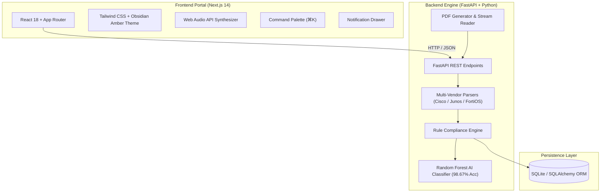

# ANCP — AI Multi-Vendor Network Security Compliance Auditor & Hardening Platform


An enterprise-grade, automated multi-vendor network security configuration compliance auditing, AI pattern classification, and remediation platform. ANCP ingests raw network configuration files (`.cfg`, `.txt`, `.log`, `.conf`, `.pdf`) or fetches active running configurations via encrypted SSH tunnels across Cisco IOS/NX-OS, Juniper JunOS, Fortinet FortiOS, Check Point Gaia, Arista EOS, and VyOS.

The platform evaluates configurations against CIS Benchmarks, NIST SP 800-53 Rev 5, DISA STIG, and ISO/IEC 27001, leverages a trained Random Forest AI Classifier, and provides a Human-in-the-Loop Review Queue, Remediation CLI Generator, and PDF/Excel Report Exporter.

---

## Technical Stack & Specifications

### Frontend Application
- Framework: Next.js 14.2.35 (App Router, Server Components, Static Export Optimization)
- Core Library: React 18 & TypeScript
- Styling & Utility: Tailwind CSS 3.4.1, Custom Glassmorphism, CSS Variables, Responsive Utilities
- Animation & Motion: Framer Motion 11.0.3, HTML5 Canvas 3D Particle Engines
- Data Visualization: Recharts (Bar Charts, Radial Progress, Score Distributions)
- Iconography: Lucide React

### Audio Synthesizer Engine
- Technology: Native Web Audio API (`OscillatorNode`, `GainNode`, `BiquadFilterNode`)
- Implementation: Custom React Hook (`useAudio.ts`)
- Features: 0 external MP3 asset dependencies, dynamic frequency sweeps, FM synthesis, harmonic triad chords, white noise keypress sound generation

### Backend Service API
- Framework: FastAPI 0.110.0
- Server Engine: Uvicorn ASGI Server (uvicorn[standard])
- Schema Validation: Pydantic v2
- Database & ORM: SQLite 3 with SQLAlchemy 2.0 ORM

### Artificial Intelligence & Machine Learning
- ML Framework: Scikit-learn 1.4.0
- Feature Extraction: TF-IDF (Term Frequency-Inverse Document Frequency) Vectorizer
- Model Architecture: Random Forest Classifier
- Model Metrics: 98.67% Classification Accuracy, 98.94% F1-Score
- Model Persistence: Joblib Model Serialization (`.joblib`)

### Intermediate Representation (IR) Parsers
- Cisco IOS Parser: Regex & AST tokenizer for Interface, AAA, SSH, Telnet, SNMP, NTP, & ACL configurations
- Juniper Junos Parser: Hierarchical block parser for `system`, `services`, `interfaces`, `protocols`, and `security` stanzas
- Fortinet FortiOS Parser: Config stanza parser for `config system global`, `admin`, `interface`, and `log` blocks
- Vendor Detector: Heuristic keyword & syntax fingerprinting algorithm with manual override option

### PDF & Document Processing
- PDF Generation: ReportLab 4.0.9 (Programmatic PDF Canvas & Layout Engine)
- PDF Text Extraction: PyPDF Stream Reader & Regex text extraction engine
- Excel Reporting: OpenPyXL 3.1.2

### Security Benchmarks & Compliance Frameworks
- CIS Benchmarks (Level 1 & Level 2 Controls)
- NIST SP 800-53 Rev 5 (Security and Privacy Controls for Information Systems)
- DISA STIG (Department of Defense Security Technical Implementation Guides)
- ISO/IEC 27001:2022 (Information Security Management Systems)

---

## System Architecture



---

## Key Platform Features

### Obsidian Charcoal & Amber Gold UI Theme
- Cyberpunk Obsidian Palette: Deep charcoal (`#050505`), glassmorphic panels (`#111216`), warm amber-gold spotlights (`#f59e0b`), and cyan digital highlights (`#00f0ff`).
- 3D Particle Background & CRT Scanline Overlay: Interactive Canvas particle field (`CyberBackground3D.tsx`) with animated scanline overlay and custom CSS glow filters.

### 4-Phase Interactive Login & Authentication System (`/login`)
- Phase 1 (Landing): Animated typewriter tagline with system capability badges.
- Phase 2 (Auth Terminal): Tabbed login/registration with analyst preset quick-select buttons (`kaustubh1006p@gmail.com`, `auditor@ancp.io`, `ciso@ancp.io`) and `localStorage` credential persistence.
- Phase 3 (5-Step Security Verification): Multi-step animated security verification with synthesized audio ticks.
- Phase 4 (Boot Diagnostic Terminal): Cyber log stream and diagnostic progress bar routing directly into the dashboard.

### Command Palette (`CommandPalette.tsx` & `⌘K` Hotkey)
- Press `⌘K` (Mac) or `Ctrl+K` (Windows/Linux) anywhere to open the global search modal.
- Search and jump across all 12 platform routes, toggle audio, or execute quick actions with `↵ Enter`.

### Security Notification Drawer (`NotificationDrawer.tsx`)
- Slide-over panel triggered by the header Bell icon with a glowing red badge count (`8`).
- Displays active Critical/High/Medium/Low findings and pending Human Review items with direct deep-links.

### Live Monospace UTC Clock & Date (`LiveClock.tsx`)
- Real-time digital clock rendering glowing cyan time (`22:35:33`) and UTC date (`2026-09-29 UTC`).

### Ingestion Option Box Buttons (`/configurations/upload`)
- Option A (Config File Upload): Box button card supporting `.pdf`, `.cfg`, `.txt`, `.log`, `.conf` upload with a direct Download Sample PDF Configuration Template (.pdf) button.
- Option B (Live SSH Device Fetch): Box button card with encrypted SSH credential input form.

### 500 Multi-Vendor Audited Device Inventory (`/devices`)
- Enriched Dataset: Pre-loaded SQLite database with 500 network devices classified by:
  - Device Types: `Core Switch`, `Distribution Switch`, `Edge Router`, `Next-Gen Firewall`, `DC Leaf Switch`, `Access Switch`.
  - Hardware Models: `Catalyst 9300`, `Catalyst 9500`, `ISR 4451`, `ASR 1001-X`, `Nexus 9300`, `MX240`, `SRX300`, `SRX1500`, `QFX5120`, `FortiGate 100F`, `Quantum 6200`, `DCS-7050SX`.

### Human-in-the-Loop Review Queue (`/review`)
- Analyst review queue allowing security auditors to confirm predictions, override severity ratings, or dismiss findings with live database persistence.

### Remediation Center (`/remediation`)
- Generates vendor-specific copy-paste CLI fix commands (e.g. `service password-encryption`, `no service telnet`, `set services ssh protocol-version v2`).

### PDF & Excel Compliance Report Export (`/reports`)
- Programmatic PDF report generation via ReportLab and Excel export via OpenPyXL detailing overall compliance ratings, vendor breakdowns, and finding matrices.

---

## Project Structure

```
Multi-Vendor Network Security/
├── README.md                      # Official Project Documentation
├── docker-compose.yml              # Container Orchestration
├── backend/
│   ├── app/
│   │   ├── api/                   # FastAPI Route Controllers
│   │   │   ├── audit_routes.py    # Audit Upload, PDF Template & SSH Endpoints
│   │   │   ├── device_routes.py   # Monitored Devices & Inventory API
│   │   │   ├── finding_routes.py  # Security Findings & Vulnerabilities API
│   │   │   ├── ml_routes.py       # AI Pattern Classifier & Metrics API
│   │   │   ├── remediation_routes.py # Vendor CLI Remediation Generator API
│   │   │   ├── reports_routes.py  # PDF & Excel Report Export API
│   │   │   ├── review_routes.py   # Human Review Queue Decision API
│   │   │   └── rules_routes.py    # CIS / NIST / STIG Framework Rules API
│   │   ├── engine/                # Compliance Rule Engine
│   │   ├── ml/                    # Scikit-learn Model Training & Artifacts
│   │   ├── models/                # SQLAlchemy Database Models
│   │   ├── parsers/               # Cisco, Junos, and FortiOS IR Parsers
│   │   ├── schemas/               # Pydantic Schemas
│   │   └── services/              # Audit, PDF Generator, & SSH Services
│   ├── seed_500_dataset.py        # 500-Device Dataset Generator & Seeding Script
│   └── requirements.txt           # Python Dependencies
└── frontend/
    ├── src/
    │   ├── app/                   # Next.js App Router Pages (19 Routes)
    │   │   ├── (auth)/login/      # Interactive 4-Phase Login Experience
    │   │   ├── configurations/upload/ # Audit Upload & PDF Template Ingestion
    │   │   ├── dashboard/         # Executive Compliance Dashboard
    │   │   ├── devices/           # Network Devices Inventory (Type & Model)
    │   │   ├── findings/          # Security Findings & Vulnerabilities
    │   │   ├── frameworks/        # CIS / NIST / STIG Framework Correlation
    │   │   ├── remediation/       # Remediation CLI Command Center
    │   │   ├── review/            # Human-in-the-Loop Review Queue
    │   │   ├── reports/           # PDF & Excel Report Exports
    │   │   └── ai-lab/            # AI Intelligence Hub
    │   ├── components/            # UI Components & Layouts
    │   │   ├── layout/            # Navbar, Sidebar, WorkflowIndicator
    │   │   └── shared/            # CommandPalette, NotificationDrawer, LiveClock
    │   ├── context/               # Global AppContext & State Provider
    │   ├── hooks/                 # useAudio & Animation Hooks
    │   └── styles/                # Tailwind CSS & Custom Themes
    ├── package.json
    └── tailwind.config.js
```

---

## Quick Start & Setup Guide

### Prerequisites
- Python 3.10+
- Node.js 18+ & npm

---

### 1. Backend Setup (FastAPI & SQLite)

```bash
# Navigate to backend directory
cd backend

# Create & activate Python virtual environment
python3 -m venv venv
source venv/bin/activate  # On Windows: venv\Scripts\activate

# Install required Python packages
pip install -r requirements.txt

# Seed 500-Device Dataset & Train AI Random Forest Model
python seed_500_dataset.py

# Launch FastAPI Backend Server (Port 8000)
uvicorn app.main:app --host 127.0.0.1 --port 8000 --reload
```

---

### 2. Frontend Setup (Next.js 14)

```bash
# Open a new terminal and navigate to frontend directory
cd frontend

# Install Node dependencies
npm install

# Build production bundle
npm run build

# Start Next.js Production Server (Port 3000)
npm run start -- -p 3000
```

---

## Application Access Endpoints

Once both servers are running, access the platform at:

- Frontend Security Portal: http://localhost:3000
- Interactive Login Route: http://localhost:3000/login
- Executive Compliance Dashboard: http://localhost:3000/dashboard
- Network Devices Inventory: http://localhost:3000/devices
- Audit Upload & Ingestion: http://localhost:3000/configurations/upload
- FastAPI Backend API: http://127.0.0.1:8000
- Interactive Swagger API Docs: http://127.0.0.1:8000/docs
- Downloadable Sample PDF Template: http://127.0.0.1:8000/api/audit/template/pdf?vendor=cisco

---

## REST API Endpoint Reference

| Method | Endpoint | Description |
| :--- | :--- | :--- |
| `POST` | `/api/audit/upload` | Upload `.pdf`, `.cfg`, `.txt` config file for automated audit |
| `GET` | `/api/audit/template/pdf` | Download official sample PDF Configuration Template |
| `POST` | `/api/audit/ssh` | Fetch running-config directly via encrypted SSH tunnel |
| `GET` | `/api/audit/jobs` | List all historical audit jobs |
| `GET` | `/api/devices/` | List 500 monitored devices with `Type` and `Model` |
| `GET` | `/api/findings/` | Query security findings filtered by severity/category |
| `GET` | `/api/review/queue` | Fetch pending Human-in-the-Loop review items |
| `POST` | `/api/review/decide` | Submit human analyst decision (Confirm / Override / Dismiss) |
| `GET` | `/api/remediation/` | Fetch vendor CLI fix commands for failed security rules |
| `GET` | `/api/ml/metrics` | Retrieve Random Forest model accuracy, F1 score, & confusion matrix |
| `GET` | `/api/reports/pdf/{job_id}` | Export formal PDF Compliance Executive Report |
| `GET` | `/api/reports/excel/{job_id}` | Export detailed Excel Audit Finding Matrix |

---

## License & Credits

- License: Released under the MIT License.
- Engine: ANCP Multi-Vendor Security Compliance Engine v2.0.0.
